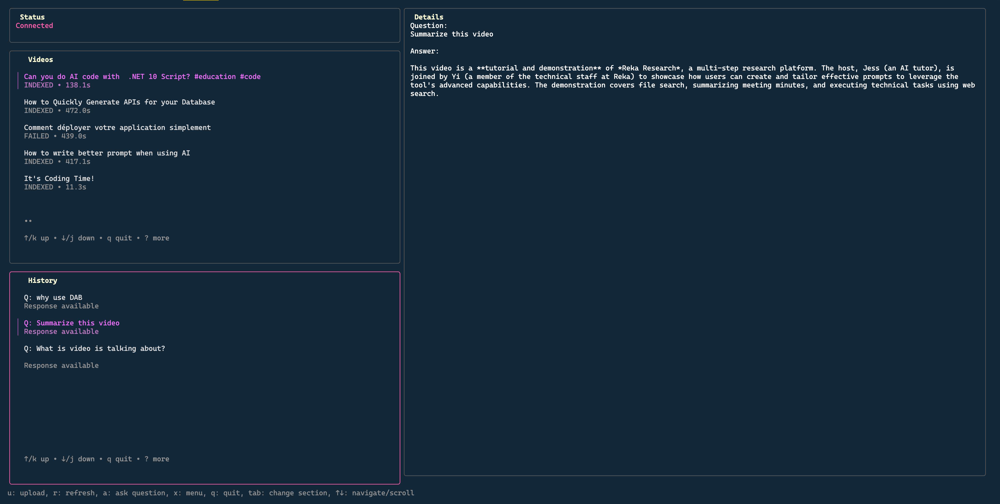

# Be My Eyes

[![Reka AI](https://img.shields.io/badge/Power%20By-2E2F2F?style=flat&logo=data%3Aimage%2Fsvg%2Bxml%3Bbase64%2CPD94bWwgdmVyc2lvbj0iMS4wIiBlbmNvZGluZz0iVVRGLTgiPz4KPHN2ZyBpZD0iTGF5ZXJfMSIgZGF0YS1uYW1lPSJMYXllciAxIiB4bWxucz0iaHR0cDovL3d3dy53My5vcmcvMjAwMC9zdmciIHZpZXdCb3g9IjAgMCA2NjYuOTQgNjgxLjI2Ij4KICA8ZGVmcz4KICAgIDxzdHlsZT4KICAgICAgLmNscy0xIHsKICAgICAgICBmaWxsOiBub25lOwogICAgICB9CgogICAgICAuY2xzLTIgewogICAgICAgIGZpbGw6ICNmMWVlZTc7CiAgICAgIH0KICAgIDwvc3R5bGU%2BCiAgPC9kZWZzPgogIDxyZWN0IGNsYXNzPSJjbHMtMSIgeD0iLS4yOSIgeT0iLS4xOSIgd2lkdGg9IjY2Ny4yMiIgaGVpZ2h0PSI2ODEuMzMiLz4KICA8Zz4KICAgIDxwYXRoIGNsYXNzPSJjbHMtMiIgZD0iTTMxOC4zNCwwTDgyLjY3LjE2QzM2Ljg1LjE5LS4yOSwzNy4zOC0uMjksODMuMjd2MjM1LjEyaDc0LjkzVjcxLjc1aDI0My43M1YwaC0uMDNaIi8%2BCiAgICA8cGF0aCBjbGFzcz0iY2xzLTIiIGQ9Ik03Mi45NywzNjIuOTdIMHYzMTguMTZoNzIuOTd2LTMxOC4xNloiLz4KICAgIDxwYXRoIGNsYXNzPSJjbHMtMiIgZD0iTTMxNS4zMywzNjIuODRoLTk5LjEzbC0xMDkuNSwxMDcuMjljLTEzLjk1LDEzLjY4LTIxLjgyLDMyLjM3LTIxLjgyLDUxLjkyczcuODYsMzguMjQsMjEuODIsNTEuOTJsMTA5LjUsMTA3LjI5aDEwMS42M2wtMTYyLjQ1LTE2MS43MiwxNTkuOTUtMTU2LjY3di0uMDNaIi8%2BCiAgICA8cGF0aCBjbGFzcz0iY2xzLTIiIGQ9Ik0zNDguNTksODIuOTJ2MTUyLjIzYzAsNDUuOTIsMzcuMTYsODMuMTEsODMuMDUsODMuMTFoMjMwLjI4di03MS43OGgtMjQwLjMzVjg1Ljg3YzAtNy43NCw2LjI4LTE0LjA2LDE0LjA1LTE0LjA2aDE0NC4zMmM3Ljc0LDAsMTQuMDUsNi4yOCwxNC4wNSwxNC4wNiwwLDUuOS0zLjcxLDExLjE3LTkuMjMsMTMuMmwtMTQ3LjQ1LDU2LjIzdjcwLjczbDE3NC41Ny02Mi4yYzMzLjA0LTExLjgsNTUuMTEtNDMuMTMsNTUuMTEtNzguMjZ2LTIuNjdDNjY3LDM3LDYyOS44LS4xOSw1ODMuOTUtLjE5aC0xNTIuMjdjLTQ1Ljg5LDAtODMuMDUsMzcuMTktODMuMDUsODMuMTFoLS4wM1oiLz4KICAgIDxwYXRoIGNsYXNzPSJjbHMtMiIgZD0iTTY2Ni45NCw1OTguMTJ2LTE1Mi4yM2MwLTQ1Ljg5LTM3LjE2LTgzLjExLTgzLjA1LTgzLjExaC0yMzAuMjh2NzEuNzhoMjQwLjMzdjE2MC42MWMwLDcuNzQtNi4yOCwxNC4wNi0xNC4wNSwxNC4wNmgtMTQ0LjMxYy03Ljc0LDAtMTQuMDUtNi4yOC0xNC4wNS0xNC4wNiwwLTUuOSwzLjcxLTExLjE3LDkuMjMtMTMuMmwxNDcuNDUtNTYuMjN2LTcwLjczbC0xNzQuNTcsNjIuMmMtMzMuMDQsMTEuOC01NS4xMSw0My4xMy01NS4xMSw3OC4yNnYyLjY3YzAsNDUuOTIsMzcuMTYsODMuMTEsODMuMDUsODMuMTFoMTUyLjI3YzQ1Ljg5LDAsODMuMDUtMzcuMTksODMuMDUtODMuMTFoLjAzWiIvPgogIDwvZz4KPC9zdmc%2B&logoSize=auto&labelColor=2E2F2F&color=F1EEE7)](https://reka.ai/)


A Terminal User Interface (TUI) for analyzing/ summarizing/ questioning / searching into videos. Simply add a video into **Be My Eyes** let AI watch it, then ask anything you want about that video!

**Be My Eyes** uses [Reka Vision API](https://www.reka.ai/) and is 100% compatible with the free tier API key.



## Features

- 🎬 **Video Library Management**: Browse your indexed videos from the Reka API
- ❓ **Interactive Q&A**: Ask questions about video content using AI
- 📜 **Query History**: Review past questions and answers
- 💾 **Local Storage**: SQLite database for persistent query history
- 🎨 **Beautiful TUI**: Clean interface built with [Bubble Tea](https://github.com/charmbracelet/bubbletea)

## Installation

You can install **Be My Eyes** using Homebrew on macOS/Linux or via a `.deb` package for Debian/Ubuntu. Install via pacman is on the todo list (haapy to get PRs!).

### Homebrew (macOS/Linux)

```bash
brew tap fboucher/tap
brew install be-my-eyes
```

#### APT (Debian/Ubuntu)

Download the `.deb` file from the [latest release](https://github.com/fboucher/be-my-eyes/releases/latest) and install:

```bash
sudo apt install be-my-eyes_*_amd64.deb
```

## Configuration

Before running the application, you need to configure your Reka API key, get yours at [here 🔑](https://link.reka.ai/free). Then you can use one of the following options.

### Option 1: Environment Variable

```bash
export REKA_API_KEY=your_api_key_here
```

### Option 2: Configuration File (Recommended)

The application will automatically save your API key from the environment variable to `~/.config/be-my-eyes/config.json` on first run. Alternatively, create it manually:

```json
{
  "api_key": "your_api_key_here"
}
```

## Usage

Run the application:

```bash
be-my-eyes
```

### Key Bindings

#### Main View

| Key | Action |
|-----|--------|
| `q` | Quit the application |
| `r` | Refresh video library from API |
| `a` | Ask a question about the selected video |
| `x` | Open the menu |
| `?` | Show help screen |
| `tab` | Switch between sections (Videos → History → Videos) |
| `↑` / `↓` | Navigate up/down in lists |
| `j` / `k` | Navigate up/down (Vim-style) |
| `enter` | Select an item |
| `ctrl+c` | Force quit |

#### Question Dialog

| Key | Action |
|-----|--------|
| `ctrl+s` | Submit the question |
| `esc` | Cancel and return to main view |

#### Menu, Help, About Screens

| Key | Action |
|-----|--------|
| `esc` | Return to main view |
| `enter` | Execute selected menu action |
| `↑` / `↓` | Navigate menu items |


## Development

Have a look at [DEVELOPER.md](DEVELOPER.md) for more information on building from source and the project structure.

## Contributing

Contributions are welcome! Please see [CONTRIBUTING.md](CONTRIBUTING.md) for guidelines.

## References

- [Reka AI API Docs](https://link.reka.ai/doc-vision)

## Support

This is at a demo stage. If you encounter any issues or have questions, please [open an issue on GitHub](https://github.com/fboucher/be-my-eyes/issues).

## License

MIT License - see [LICENSE](LICENSE) for details
